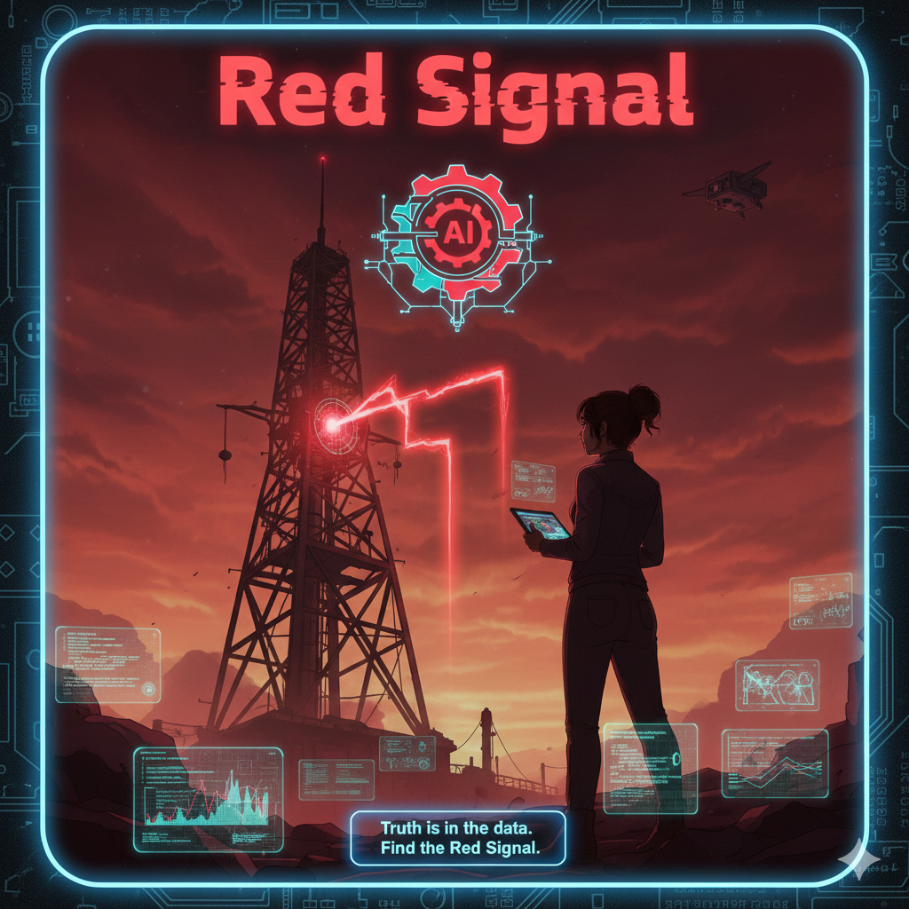

  

<h1 align="center">🔻 붉은 신호 - Red Signal</h1>

  
  
  

---

## 📖 프로젝트 개요
가천대학교 2025년도 2학기 한국어문학과 전공필수 과목 <P-실무 프로젝트 / 지도 교수 : 전성규 교수님>에서 SF 소설 기반 텍스트 어드벤처 게임 제작이라는 주제로 진행된 프로젝트입니다. 프로젝트의 조건은 아래와 같습니다.
 
- 클로드 / GPT 등 **생성형 AI**를 활용하여 스토리 제작
- 메인 스토리 제작 후 **선택지 생성 하기**
  - 메인 스토리 분량: **3페이지 이상**
  - **생성 이미지 첨부하기**
  - **선택지 3개 이상** 제공하기
- 선택지에 따른 **분기 스토리 제작하기**
- 각 선택지에 따른 **작은 스토리 전개하기**

---

## 🧩 핵심 특징  
- 18개 이상의 스토리 노드로 구성된 확장형 분기 구조
- 5가지 엔딩(A~E) 을 통해 선택에 따라 전혀 다른 결말 도출
- 독립 실행 가능한 HTML 빌드 제공 (별도 프로그램 없이도 플레이 가능)
- 어디서 열어도 동일한 화면을 유지하도록 IBM Plex Sans 폰트를 HTML 내부에 완전 임베딩
- 어두운 톤의 SF UI 스타일링 적용

---

## 📦 릴리즈 링크
👉 **[Download v1.0 Final Release](https://github.com/hyunbini/GachonUniv_P_Project_2025_2/releases/tag/v1.0)**

릴리즈 링크를 통해 다음 파일을 다운로드 받을 수 있습니다:
- 개발자를 위한 `Red_Signal_Final_Version.twee`
  
- 유저를 위한 `Red_Signal_Final.html`
---

## 📝 줄거리 요약  
화성 채굴 기지 **레드스핀**에서 연구관 **리아**는 광산 깊숙한 곳에서 반복되는 암호화 신호를 포착한다.  
그러나 본부와 위원회는 이 사실을 은폐하려 하고, 데이터는 검열되고 로그는 조작된다.  
도시는 점점 정보 왜곡, 검열, 부정 선거의 소용돌이에 빠지며, 리아는 진실을 밝히거나 침묵 속에서 살아가야 하는 기로에 선다.

At Mars mining base Redspin, researcher Lia captures repeated **encrypted signals** deep in the mine.  
But the headquarters and the committee try to cover this up; the data is censored and the logs are manipulated.  
The city increasingly falls into a whirlwind of information distortion, censorship, and rigged elections, and Lia stands at a crossroads where she must reveal the truth or live in silence.

---

## 🛠️ 기술적 요소  
- Twine 
- HTML/CSS  

---

## 👤 Author  
- Hyun-Bin Kim  
** 본 프로젝트는 Twine 기반 인터랙티브 구조와 생성형 AI(GPT5.1/Gemini)를 활용하여 서사 확장・분기 설계・이미지 생성 등을 수행하였습니다.
